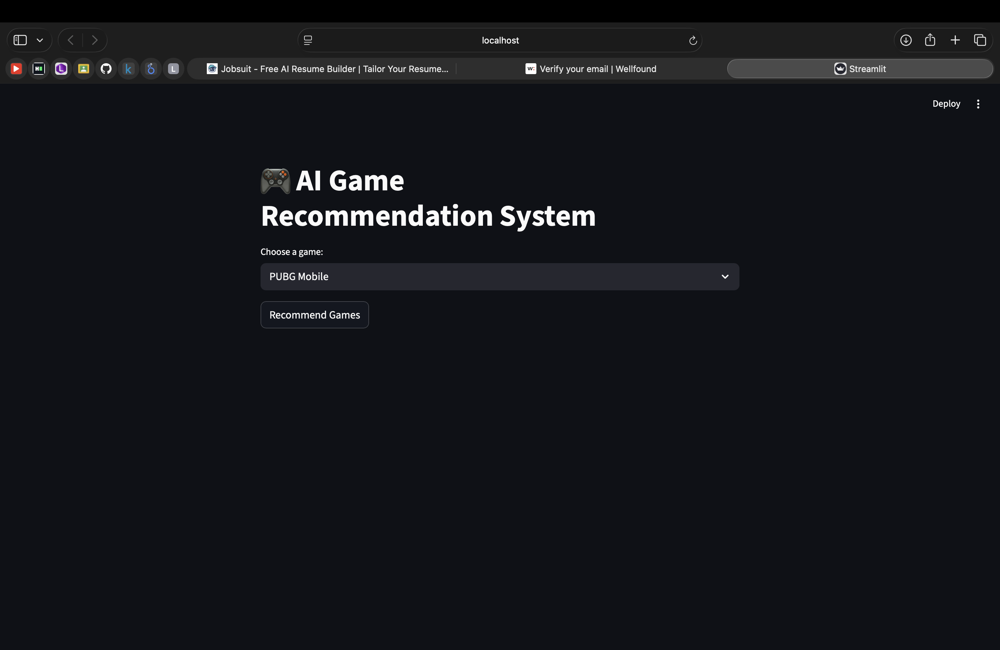
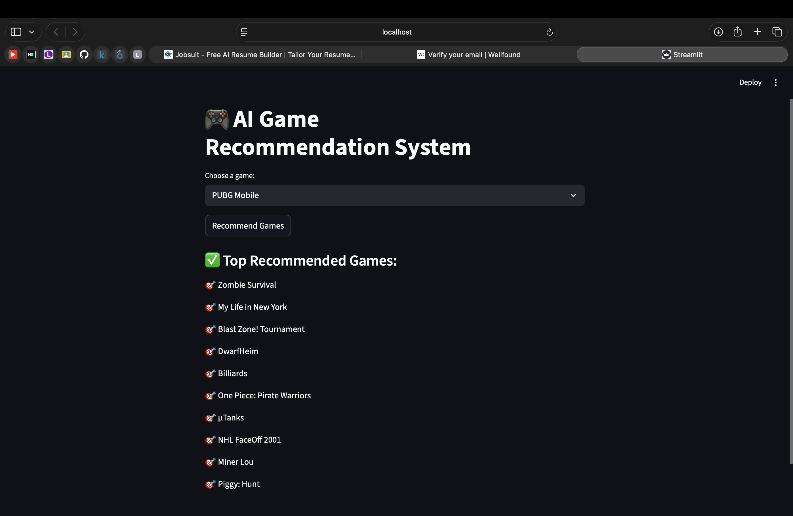

# 🎮 AI Game Recommendation System

A **content-based recommendation system** using **TF-IDF & Cosine Similarity** to suggest similar games based on description, genre, and platforms.

---

## ✅ Features
- 🎯 Content-based filtering (no user history needed)
- 🧠 Uses TF-IDF Vectorization
- 📐 Uses Cosine Similarity
- ⚡ Fast recommendations
- 🌐 Interactive Streamlit web app

---

## 📸 App Preview

| Home Screen | Recommendations |
|------------|------------------|
|  |  |

---

## 🛠 Tech Stack
- Python
- Pandas, NumPy
- Scikit-Learn
- TF-IDF Vectorizer
- Cosine Similarity
- Streamlit

---

## 📁 Project Structure
game-recommendation-system/
│── app.py        # Streamlit web app
│── df.pkl        # Cleaned dataset
│── README.md     # Project documentation

---

## ⚙️ How It Works
1. Game descriptions, genres, and platforms are combined into one text field  
2. Text is converted into numbers using **TF-IDF**
3. **Cosine Similarity** measures how similar two games are
4. When a user selects a game:
   - The model finds the most similar games
   - Displays the **Top 10 recommendations**

---

## ▶️ How To Run Locally
```bash
pip install -r requirements.txt
streamlit run app.py
```
📊 Example Output

User selects: Crysis 2
Recommended:
	- Crysis 3  
    - Crysis Remastered  
    - F.E.A.R. 2  
    - Painkiller  
    - And more…
	
🧠 What I Learned
	•	Real-world NLP preprocessing
	•	TF-IDF & similarity search
	•	Building recommender systems
	•	Deploying ML apps with Streamlit
	•	Managing large ML projects on GitHub

🚀 Future Improvements
	•	Add user-based collaborative filtering
	•	Add filters by platform & rating
	•	Add game posters
	•	Deploy live on Streamlit Cloud
	
## 👨‍💻 Author
**Ashlin Bayer**  
Machine Learning | AI | Data Science
